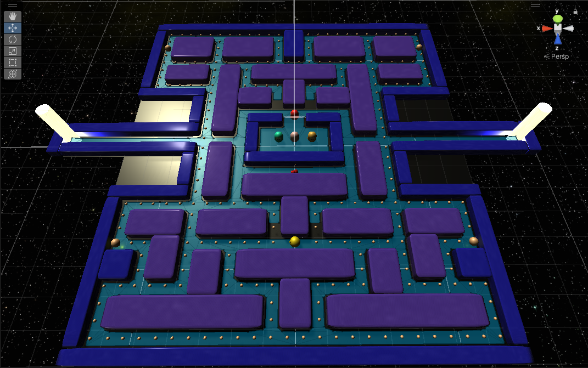
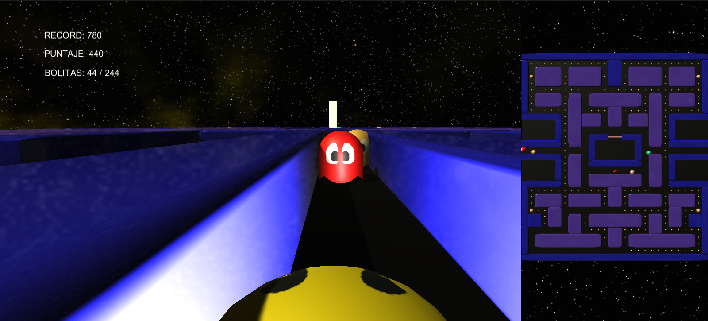

# Unity 3D - Recreación de Pac-Man

> ⚠️ **IMPORTANTE:** Este proyecto fue desarrollado únicamente con fines académicos y de aprendizaje en el año 2022. "Pac-Man" y sus conceptos originales son propiedad intelectual de Bandai Namco Entertainment. Esta es una recreación interactiva sin fines comerciales creada para demostrar habilidades de lógica y programación en Unity.

Esta es una recreación interactiva en 3D del clásico juego de arcade Pac-Man, desarrollada originalmente a mediados de 2022 utilizando el motor de desarrollo Unity. El proyecto traslada la experiencia clásica bidimensional a un entorno 3D en primera persona, recreando las mecánicas básicas de juego.

## 🛠️ Características Técnicas

Para el desarrollo de este proyecto, se ha buscado recrear el juego original en base a los conocimientos aprendidos de un curso para desarrollo de videojuegos 3D en Unity:

*   **Movimiento del jugador:** El jugador Pac-Man se mueve en un entorno 3D, lo cual agrega algo de desafío al girar en las esquinas. Para compensar, se ha agregado la habilidad de saltar, lo cual es util para esquivar a los fantasmas y saltar sobre las paredes (excepto las que llevan al jugador fuera del escenario).
*   **Inteligencia Artificial (IA) de los Enemigos:** Los fantasmas se mueven a través de un agente "Nav Mesh", lo cual les indica que areas del mapa pueden recorrer. Además de implementar los comportamientos de los fantasmas de persecución y pánico (cuando el jugador consume una súper píldora), cada fantasma cuenta con su propio target al perseguir a Pac-Man en el modo persecución, similar al juego original.
*   **Objetos del escenario:** Además de las bolitas y súper pildoras que come Pac-Man, también se incluyó una fruta coleccionable y teletransportadores que cambian la posición tanto del jugador como los enemigos.
*   **Modelado Propio:** Los entornos, personajes y coleccionables fueron modelados desde cero utilizando Maxon Cinema 4D, evitando el uso de assets extraidos de juegos oficiales.
*   **Game Management:** Uso de un `GameManager` centralizado para controlar el flujo de la partida (Inicio, Puntuación, Vidas, Game Over y Transición de Niveles).

## 🚀 Especificaciones del Entorno

*   **Motor:** Unity 2022.3 LTS
*   **Lenguaje de Programación:** C# (.NET Standard)
*   **Modelado 3D:** Modelos originales creados por el autor.
*   **Audio:** El proyecto se distribuye sin recursos de audio para evitar infracciones de propiedad intelectual.

## 👥 Créditos y Assets de Terceros

*   **Skybox Espacial:** [Free Skyboxes - Space](https://assetstore.unity.com/packages/2d/textures-materials/sky/free-skyboxes-space-178953) por Dogmatic (utilizado bajo la Licencia Estándar de la Unity Asset Store).